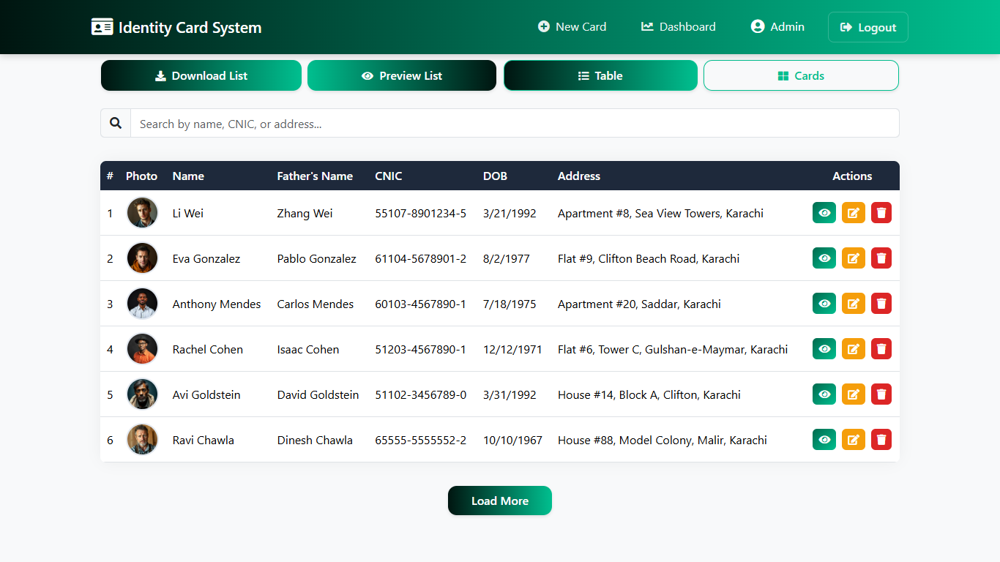

<div align="center">

# 🆔 Identity Cards Management System

[](https://nodejs.org/)
[](https://reactjs.org/)
[](https://www.mongodb.com/)
[](https://expressjs.com/)
[](https://redux.js.org/)
[](https://getbootstrap.com/)

[](https://jwt.io/)
[](https://axios-http.com/)
[](https://fontawesome.com/)
[](https://www.npmjs.com/package/qrcode)
[](https://github.com/reduxjs/redux-thunk)
[](https://www.npmjs.com/package/cors)

A full-stack web application for managing identity cards with advanced features, built using the MERN stack (MongoDB, Express.js, React.js, Node.js).

[Live Demo](https://identity-card-system.vercel.app) | [Report Bug](https://github.com/QaiserEjaz/identity-card-system/issues)

<!--  -->

</div>

## ✨ Features

### 🎯 Core Functionality

- Create, read, update, and delete identity cards
- Image upload for photos and signatures
- PDF generation and preview
- QR code generation for each card
- Responsive design for all devices
- Multiple view options (Card/Table view)

### 💡 Advanced Features

- Real-time form validation
- Interactive UI with animations
- Secure file upload handling with size restrictions (500KB max)
- Advanced data visualization with charts
- Pagination and dynamic search
- Role-based authentication
- Admin dashboard with statistics
- Image compression and optimization
- Responsive design across all devices

### 🔒 Security Features

- JWT-based authentication
- Protected routes and API endpoints
- File upload validation and sanitization
- Input data validation
- Rate limiting protection
- Secure password handling

### 📊 Dashboard Features

- Activity trends visualization
- Gender distribution charts
- Religion distribution analytics
- Age group statistics
- Real-time data updates
- Customizable time ranges

---

## 📸 Screenshots & Interface

<div align="center">

### 🔐 Login Interface


### 🖥️ Dashboard View


### 📝 Input Form Interface


### 🎴 Card View Layout


### 📋 List View Interface



### 📱 Card Detail Interface


### 📄 PDF Export Feature


</div>

### Key Interface Features:

- Clean and intuitive dashboard layout
- Responsive card detail view
- Professional PDF export design
- Dark/Light mode support
- Mobile-friendly interface
- Interactive data tables
- Modern form controls

---

## 🛠️ Tech Stack

### Frontend

- React.js with Vite
- Redux Toolkit for state management
- Bootstrap 5 with custom animations
- Chart.js for data visualization
- Axios for API integration
- jsPDF for document generation
- QR Code generation
- FontAwesome icons
- Custom CSS with responsive design

### Backend

- Node.js & Express.js
- MongoDB with Mongoose
- Multer for file handling
- CORS enabled
- Rate limiting
- Environment variables

---

## 🚀 Live Demo

- Frontend: [https://identity-card-system.vercel.app](https://identity-card-system.vercel.app)
- Updated Backend: [https://identity-card-system-u48c.vercel.app](https://identity-card-system-u48c.vercel.app)

### 📄 Exported PDF Example


---

## 📱 Application Structure

```plaintext
identity-card-system/
├── backend/
│   ├── routes/
│   ├── models/
│   ├── middleware/
│   ├── uploads/
│   ├── .env
│   ├── .env.production
│   ├── db.js
│   ├── index.js
│   └── README.md
│
├── frontend/
│   ├── src/
│   │   ├── components/
│   │   ├── pages/
│   │   ├── redux/
│   │   ├── services/
│   │   ├── styles/
│   │   ├── utils/
│   │   ├── App.jsx
│   │   ├── App.css
│   │   ├── index.css
│   │   └── main.jsx
│   ├── .env
│   ├── .env.production
│   ├── public/
│   ├── index.html
│   ├── README.md
│   ├── vercel.json
│   └── vite.config.js
│
├── docs/
│
├── .gitignore
├── package-lock.json        # Project locked dependencies
├── package.json            # Project dependencies
└── README.md
```

---

## 🚀 Quick Start

### Prerequisites

- Node.js (v14+)
- MongoDB
- npm/yarn

### Installation

```bash
git clone https://github.com/QaiserEjaz/identity-card-system.git
cd identity-card-system
```

2. Backend Setup

```bash
cd backend
npm install
```

#### Create .env file in backend directory:

```plaintext
MONGODB_URI=your_mongodb_connection_string
PORT=5000
```

3. Frontend Setup

```bash
cd ../frontend
npm install
```

#### Create .env file in frontend directory:

```plaintext
VITE_API_URL=http://localhost:5000
```

---

## � Deploying to Vercel

You can deploy the frontend and backend to Vercel. There are two recommended approaches:

1. Separate projects (recommended)

- Create two Vercel projects:

  - Frontend: point to the `frontend` folder. This is a static site built by Vite.
  - Backend: point to the `backend` folder. The backend exposes a Serverless Function at `backend/api/index.js`.

- For the backend project set the Root Directory to `backend` in the Vercel project settings. Vercel will install dependencies from `backend/package.json` and build the function.

- Ensure the following environment variables are set in the backend project (Vercel > Settings > Environment Variables):
  - `MONGODB_URI` — your MongoDB connection string
  - `NODE_ENV=production`

2. Single monorepo project

- You can also deploy the whole repo as a monorepo, but you must configure two separate projects in Vercel or use monorepo settings to build each part. For simplicity, creating two projects is easier.

Notes:

- The backend uses `serverless-http` and exports a serverless handler. The backend `vercel.json` (located in `backend/vercel.json`) maps incoming requests to `api/index.js` so API routes like `/api/cards` will work.
- Locally you can continue to run the frontend and backend concurrently with `npm run dev` from the repository root.

## �👏 Acknowledgments

- **Design Inspiration**

  - Material Design Guidelines
  - Bootstrap Documentation & Examples
  - Dribbble ID Card Designs

- **Technical Resources**

  - React.js Documentations
  - MongoDB University Tutorials
  - Express.js Official Guides
  - Redux Toolkit Best Practices
  - Chart.js Examples Gallery

- **Libraries & Tools**

  - Bootstrap Themes
  - FontAwesome Icons
  - jsPDF Documentation
  - QRCode.react Examples
  - Axios HTTP Client
  - Multer File Upload
  - JWT Authentication
  - Vite Build Tool

- **Development Tools**
  - GitHub Version Control
  - Vercel Deployment
  - Vercel (current backend hosting)
  - MongoDB Atlas
  - VS Code Editor
  - Chrome DevTools

<!-- - **Special Thanks**
  - Open Source Community
  - Stack Overflow Contributors
  - GitHub Issues Participants
  - Beta Testers & Early Users -->

<h2 align="center">
Engineered with ⚡ Precision by Qaiser Ejaz
</h2>
