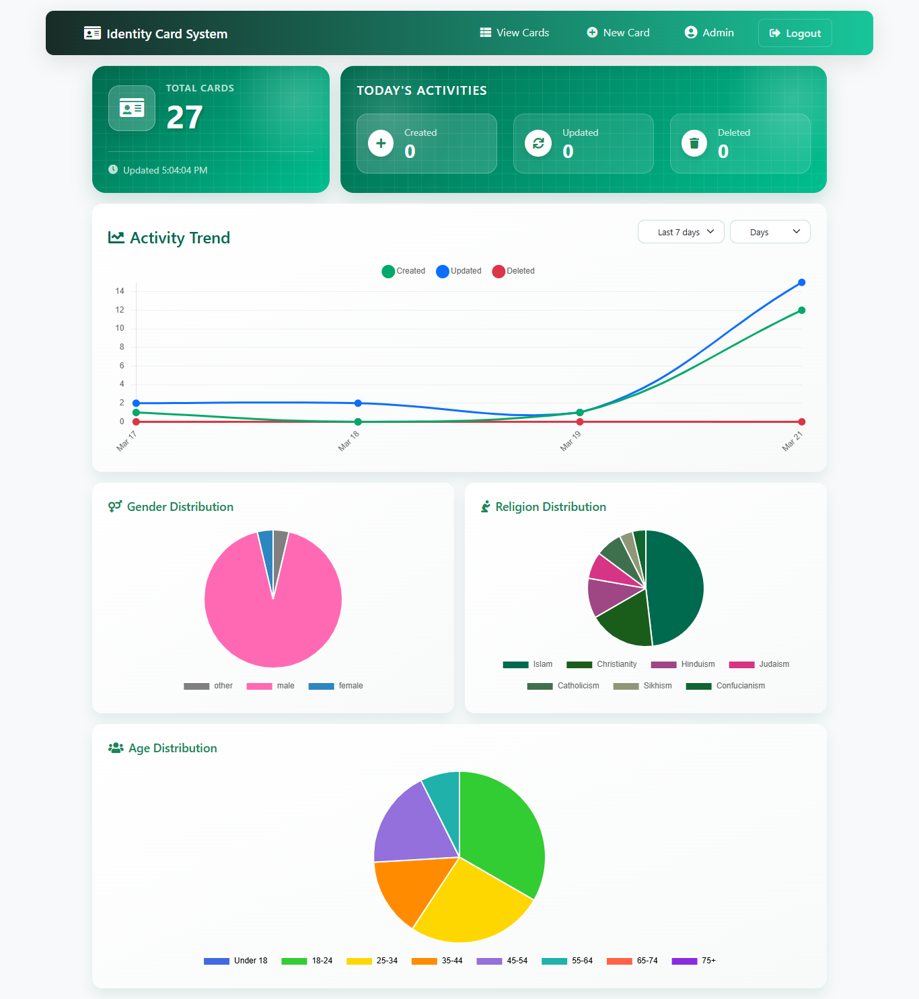

# Identity Card Management System

A full-stack web application for managing identity cards with advanced features, built using the MERN stack (MongoDB, Express.js, React.js, Node.js).



## ✨ Features

### 🎯 Core Functionality
- Create, read, update, and delete identity cards
- Image upload for photos and signatures
- PDF generation and preview
- QR code generation for each card
- Responsive design for all devices
- Multiple view options (Card/Table view)

### 💡 Advanced Features
- Real-time form validation
- Interactive UI with animations
- Secure file upload handling
- Pagination for large datasets
- Search and filter capabilities


## 🛠️ Tech Stack

### Frontend
- React.js with Vite
- Bootstrap 5 for styling
- Axios for API calls
- jsPDF for PDF generation
- QR Code generation
- FontAwesome icons

### Backend
- Node.js & Express.js
- MongoDB with Mongoose
- Multer for file handling
- CORS enabled
- Rate limiting
- Environment variables

## 🚀 Live Demo

- Frontend: [https://identity-card-system.vercel.app](https://identity-card-system.vercel.app)
- Backend: [https://identity-card-api.onrender.com](https://identity-card-api.onrender.com)


## 📱 Application Structure
```plaintext
identity-card-system/
├── frontend/
│   ├── src/
│   │   ├── components/
│   │   ├── pages/
│   │   ├── context/
│   │   └── utils/
│   ├── public/
│   └── index.html
│
├── backend/
│   ├── routes/
│   ├── models/
│   ├── middleware/
│   └── uploads/
│
└── docs/
    └── images/
 ```

## 💻 Installation

### Prerequisites
- Node.js (v14 or higher)
- MongoDB
- npm or yarn

### Setup Steps

1. Clone the repository
```bash
git clone https://github.com/yourusername/identity-card-system.git
cd identity-card-system

2. Backend Setup
```bash
cd backend
npm install
 ```

#### Create .env file in backend directory:

```plaintext
MONGODB_URI=your_mongodb_connection_string
PORT=5000
 ```

3. Frontend Setup
```bash
cd ../frontend
npm install
 ```

#### Create .env file in frontend directory:

```plaintext
VITE_API_URL=http://localhost:5000
 ```

 ## 📄 License
This project is licensed under the MIT License - see the LICENSE file for details.

## 👏 Acknowledgments
- Bootstrap themes and components
- React documentation
- MongoDB documentation
- Express.js guides