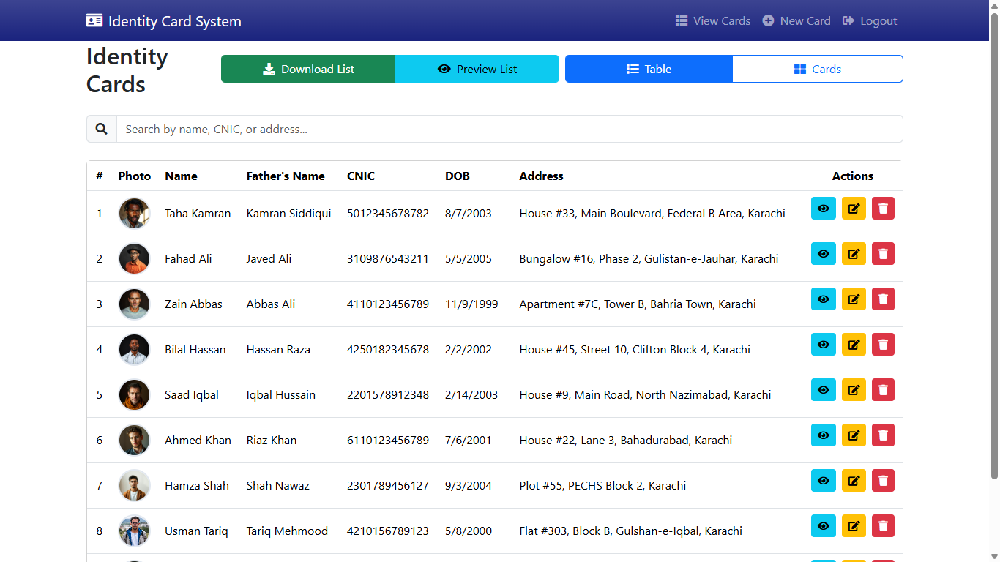

# Identity Card System Frontend

A modern React-based frontend for managing and generating digital identity cards. Built with Vite, React, and Bootstrap for a responsive and intuitive user interface.



## 🚀 Features

- **Digital ID Card Management**
  - Create, view, edit, and delete identity cards
  - Real-time form validation
  - Image upload for photos and signatures
  - Responsive card layout

- **Advanced Viewing Options**
  - Detailed card view with modern UI
  - Grid view for multiple cards
  - PDF export functionality
  - QR code generation

- **User Interface**
  - Modern and responsive design
  - Interactive animations
  - Mobile-friendly layout
  - Dark/Light mode support

## 🛠️ Technologies Used

- Vite + React
- React Router DOM
- Axios for API calls
- Bootstrap 5
- FontAwesome Icons
- jsPDF for PDF generation
- QRCode SVG for QR codes
- Custom CSS with responsive design

## 📁 Project Structure
```plaintext
frontend/
├── src/
│   ├── components/     # Reusable components
│   ├── pages/         # Page components
│   ├── context/       # React context
│   ├── utils/         # Utility functions
│   ├── assets/        # Static assets
│   ├── styles/        # CSS files
│   ├── App.jsx        # Main app component
│   └── main.jsx       # Entry point
├── public/            # Public assets
└── index.html         # HTML template
 ```

## 🔑 Key Components
- Card Management
  
  - CreateCard: Form for creating new ID cards
  - ViewData: Grid view of all cards
  - DetailedView: Detailed view of individual cards
  - EditCard: Card editing interface
- UI Components
  
  - Navigation
  - Loading spinners
  - Error boundaries
  - Modal dialogs

## 🔧 Configuration
The application can be configured through environment variables:

```plaintext
VITE_API_URL=http://localhost:5000  # Backend API URL
 ```

## 📱 Responsive Design
- Mobile-first approach
- Breakpoints:
  - Mobile: < 576px
  - Tablet: 576px - 768px
  - Desktop: > 768px


## 🤝 Contributing
1. Fork the repository
2. Create your feature branch
3. Commit your changes
4. Push to the branch
5. Create a new Pull Request

## 📄 License
This project is licensed under the MIT License - see the LICENSE file for details.

## 🎨 Design Credits
UI/UX design inspired by modern identity card systems and material design principles.

```plaintext
```

## 📦 Installation

1. Clone the repository:
```bash
git clone <repository-url>

2. Navigate to the frontend directory:
```bash
cd identity-card-system/frontend
 ```

3. Install dependencies:
```bash
npm install
 ```

4. Create a .env file in the frontend root directory:
```plaintext
VITE_API_URL=http://localhost:5000
 ```

## 🚀 Available Scripts
- Development Server
  
  ```bash
  npm run dev
   ```
  
  Runs the app in development mode at http://localhost:5173
- Build
  
  ```bash
  npm run build
   ```
  
  Builds the app for production to the dist folder
- Preview Production Build
  
  ```bash
  npm run preview
Preview the production build locally